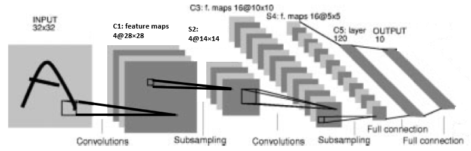

# MNIST database
- The MNIST ('Modified National Institute of Standards and Technology') database is a large database of handwritten digits that is commonly used for training and testing in the field of machine learning.
- MNIST is the de facto “hello world” dataset of computer vision. Since its release in 1999, this classic dataset of handwritten images has served as the basis for benchmarking classification algorithms. As new machine learning techniques emerge, MNIST remains a reliable resource for researchers and learners alike.
- MNIST data is provided on [Yann LeCun's](http://yann.lecun.com/exdb/mnist/) website.

# Data Description
- The dataset contain **gray-scale** images of hand-drawn digits, from zero through nine.
- Each image is 28 pixels in height and 28 pixels in width, for a total of 784 pixels in total. Each pixel has a single pixel-value associated with it, indicating the lightness or darkness of that pixel, with higher numbers meaning darker. This pixel-value is an integer between 0 and 255, inclusive.
- The MNIST database contains 60,000 training images and 10,000 testing images.

# Classifiers
|    model      | Total params | Depth | Train accuracy | Test accuracy |
|---------------|--------------|-------|----------------|---------------|
| Linear        | 7,850        | 1     | 93.42%         | 92.86%        |
| LeNet-1       | 3,246        | 5     | 98.57%         | 98.44%        |
| LeNet-4       | 51,050       | 6     | 99.82%         | 98.93%        |
| LeNet-5       | 61,706       | 7     | 99.88%         | 99.05%        |
| MCDNN(single) | 76,040       | 7     | 99.93%         | 99.29%        |

# Linear Classifier
- The simplest classifier that one might consider is a linear classifier. Each input pixel value contributes to a weighted sum for each output unit. The output unit with the highest sum (including the contribution of a bias constant) indicates the class of the input character. In this kind of classifier there are 10 * N weights + 10 biases, where N is the number of input pixels. For out 28x28 input units, we have 7850. Because this is a linear problem, the weight values can be determinded uniquely.

  

# LeNet-1
- Convolutional Networks are an attempt to solve the dilemma between small networks that cannot learn the training set, and large networks that seem over parameterized. The images were downsampled to 16x16 pixels and centered in the 28x28 input layer. Although about 100,000 multiply/add steps are required to evaluate LeNet-1, its convolutional nature keeps the number of free parameters to only about 2600.

  

# LeNet-4
- Experiments with LeNet-1 made it clear that a larger convolutional network was needed to make optimal use of the large size of the training set. LeNet-4 and later LeNet-5 were designed to address this problem. Lenet-4 is very similar to LeNet-5 except for the details of the architecture. It contains 4 first-level feature maps, followed by 4 subsampling maps connected in pairs to each first-layer feature maps, then 16 feature maps, followed by 16 sub-sampling map, followed by a fully connected layer with 120 units, followed by the output layer(10units). LeNet-4 contains about 260,000 connections and has about 17,0000 free parameters.

  

# LeNet-5
- Lenet-5 is very similar to LeNet-4 except for the details of the architecture.

  

# MCDNN (CVPR2012)
- [In this paper](https://arxiv.org/pdf/1202.2745v1.pdf), 35 networks were trained by preprocessing the data in various ways, and the results of each network were averaged and used as the final result. But this repository only uses a single model for performance comparison between single models.

  

# Reference
- [LeCun et al.(1998), GradientBased Learning Applied to Document Recognition](http://vision.stanford.edu/cs598_spring07/papers/Lecun98.pdf)
- http://yann.lecun.com/exdb/mnist/
- [Dan Ciresan et al. (2012), Multi-column Deep Neural Networks for Image Classification](https://arxiv.org/pdf/1202.2745v1.pdf)
- https://en.wikipedia.org/wiki/MNIST_database
- https://sh-tsang.medium.com/paper-brief-review-of-lenet-1-lenet-4-lenet-5-boosted-lenet-4-image-classification-1f5f809dbf17
- https://www.kaggle.com/c/digit-recognizer
- https://paperswithcode.com/sota/image-classification-on-mnist
- https://benchmarks.ai/mnist
